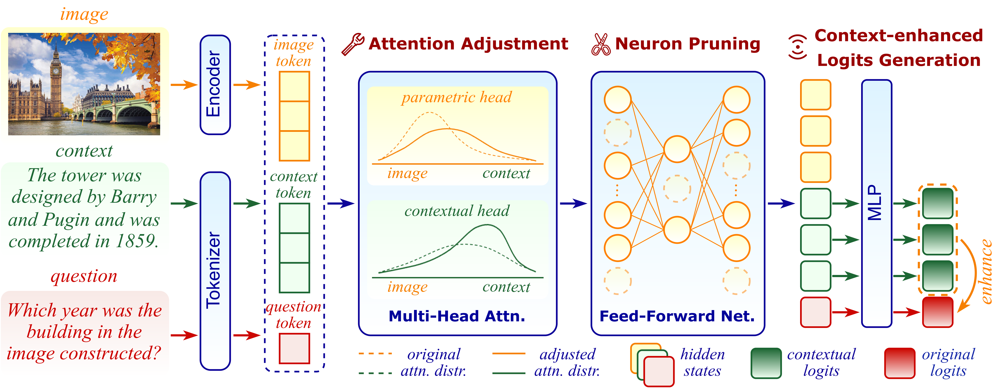

# KCM: Knowledge Conflict Mitigation

[](https://openreview.net/pdf/40d94836204a19bf22a4813c820925434476760b.pdf)

Official implementation of the paper **"Enhancing Retrieval-Augmented Large Vision Language Models
via Knowledge Conflict Mitigation"**.

## 👥 Authors
Wenbin An, Jiahao Nie, Feng Tian, Mingxiang Cai, Yaqiang Wu, Qianying Wang, Xiaoqin Zhang, Shijian Lu

## 📝 Abstract
Multimodal Retrieval-Augmented Generation (MRAG) has recently been explored to empower Large Vision Language Models (LVLMs) with more comprehensive and up-to-date contextual knowledge, aiming to compensate for their limited and coarse-grained parametric knowledge in knowledge-intensive tasks.

However, the retrieved contextual knowledge is usually not aligned with LVLMs’ internal parametric knowledge, leading to knowledge conflicts and further unreliable responses. 
To tackle this issue, we design KCM, a training-free and plug-and-play framework that can effectively mitigate knowledge conflicts while incorporating MRAG for more accurate LVLM responses. 

KCM enhances contextual knowledge utilization by modifying the LVLM architecture from three key perspectives:
**First**, KCM adaptively adjusts attention distributions among multiple attention heads, encouraging LVLMs to focus on contextual knowledge with reduced distraction. 
**Second**, KCM identifies and prunes knowledge-centric LVLM neurons that encode coarse-grained parametric knowledge, thereby suppressing interferences and enabling more effective integration of contextual knowledge. 
**Third**, KCM amplifies the information flow from the input context by injecting supplementary context logits, reinforcing its contribution to the final output. 

Extensive experiments over multiple LVLMs and benchmarks show that KCM outperforms the state-of-the-art consistently by large margins, incurring neither extra training nor external tools.

## 🏗️ Framework Overview
<div align="center">

</div>

## 📚 Contents
- [Data](#data)
- [Model](#model)
- [Requirements](#requirements)
- [Running](#running)
- [Acknowledgements](#acknowledgements)
- [Citation](#citation)

## 📊 Data
We evaluate ALFAR on five public datasets:
- [**Infoseek**](https://github.com/open-vision-language/infoseek)
- [**ViQuAE**](https://github.com/PaulLerner/ViQuAE)
- [**E-VQA**](https://github.com/google-research/google-research/tree/master/encyclopedic_vqa)
- [**OK-VQA**](https://okvqa.allenai.org/index.html)
- [**AOK-VQA**](https://github.com/allenai/aokvqa)

Question data for these datasets is provided in `data/eval_data`. Please download the corresponding images from the respective dataset links. Evaluation scripts are available in `./evaluation`.

You will also need to download the processed knowledge base from the following link: [Knowledge base](https://drive.google.com/file/d/18uFkE9SbPnUT9DLBd8DCfed6ah2sDbrJ/view?usp=sharing). After downloading, please save the file to the designated `data/wiki directory` to ensure the application functions correctly.


## 🤖 Model
ALFAR has been validated on four popular LVLMs:
- [**LLaVA**](https://github.com/haotian-liu/LLaVA)
- [**InstructBLIP**](https://github.com/salesforce/LAVIS)
- [**Shikra**](https://github.com/shikras/shikra)
- [**MiniGPT-4 (Llama 2 Chat 7B)**](https://github.com/Vision-CAIR/MiniGPT-4)

## ⚙️ Requirements
- Python 3.9
- Core dependencies listed in `requirements.txt`, please note that TensorFlow is additionally required to run the E-VQA evaluation.

## 🚀 Running
To run experiments, navigate to the `experiments/eval` directory and execute:

For multi-choice evaluation (example with LLaVA on Infoseek):
```bash
python alfar_mc_llava.py --dataset infoseek --image-folder /path/to/infoseek/images
```


## 🙏 Acknowledgements
Our implementation refers to the repositories of [ALFAR](https://github.com/Lackel/ALFAR), [VCD](https://github.com/DAMO-NLP-SG/VCD), and [PAI](https://github.com/LALBJ/PAI). We thank the authors for their valuable work.

## 📄 Citation
If you find our work useful, please consider citing:
```bibtex
@article{an2026kcm,
  title={Enhancing Retrieval-Augmented Large Vision Language Models via Knowledge Conflict Mitigation},
  author={An, Wenbin and Nie, Jiahao and Tian, Feng and Cai, Mingxiang and Wu, Yaqiang and Wang, Qianying and Zhang, Xiaoqin and Lu, Shijian},
  journal={arXiv preprint arXiv:2406.12718},
  year={2024}
}
```

---
<div align="center">
<sub>✨ If you like our work, give it a star! ⭐</sub>
</div>